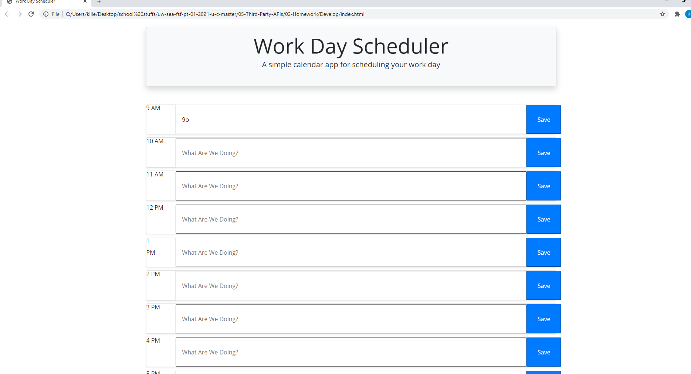

# day-planner

## Summary 

The application is used as a day planner displaying the date, the time in a work day from 9-5 allowing users to loog and save their daily plans

## Site Picture 

  
 

## Technologiy in the application

- javascript  Used to  change html and save user-input.
- momentjs - Used to grab current date and local time.

- HTML - Used to create elements on the DOM

- jQuery was used for all of the event listeners and parent and child elements

- Bootstrap - Used to style this website

- CSS - Styles html elements on page

- GitHub - Holds the repository for all of our data
 

## Authors

Ryoma Kobayashi

- [Link to Github](https://github.com/ryokoba689)

